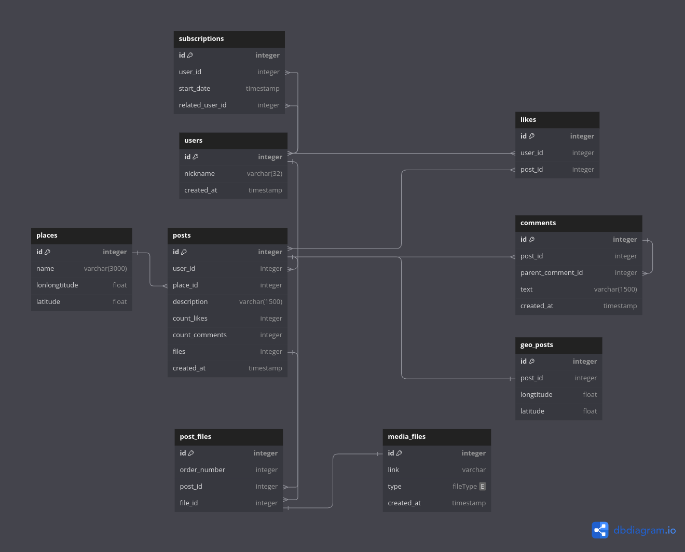

# Social Network - System Design

System Design социальной сети для курса по [System Design](https://balun.courses/courses/system_design).

### Функциональные требования:
- публикация постов из путешествий с фотографиями, небольшим описанием и привязкой к конкретному месту путешествия;
- оценка и комментарии постов других путешественников;
- подписка на других путешественников, чтобы следить за их активностью;
- поиск популярных мест для путешествий и просмотр постов с этих мест;
- просмотр ленты других путешественников;

### Нефункциональные требования:
- 10 000 000 DAU
- Доступность (availability) 99,95%
- Данные храним всегда
- Аудитория стран СНГ (гео распределение не потребуется)
- Сезонности у приложения нет
- Каждый пользователь в среднем подписывается на 5 путешественников в неделю 
- Каждый пользователь в среднем 10 раз в сутки просматривает ленту других путешественников и смотрит популярные места
- Каждый пользователь в среднем оставляет 2 комментария в сутки
- Считаем что "оценка" поста это обычный "лайк"
- Каждый пользователь в среднем ставит 5 лайков под чужими постами
- Каждый пост в среднем содержит 1 фото
- В среднем каждый 25й пользователь просматривает комментарии поста
- <b>Ограничения</b>:
- 5 постов в день.
- Каждый пост содержит максимум 3 фото
- Максимальная длина текста в посте: 1500 символов + координаты(долгота и широта) примем 50 символов.
- Максимальная длина комментария 500 символов
- При просмотре ленты выводится лишь 1 пост на каждого пользователя
- Максимальное количество комментариев у одного поста не ограничено
- Максимальное количество подписок у одного пользователя: 5000
- Максимальный размер изображения в посте: 1мб, если больше, то фото сжимается до размера 1мб.
- <b>Тайминги</b>:
- Максимальное время на публикацию поста: 1 секунда
- Максимальное время на оценку и комментарий пользователя: 1 секунда
- Максимальное время на поиск популярных мест для путешественников: 3 секунды
- Максимальное время для отображения ленты путешественников: 2 секунды

## Базовые расчёты:

    0. Примем для расчётов что на одном хосте у нас будет по 2 диска.
    1. Replication factor = 2

### Посты:
RPS (создание):

    10 000 000 * 3 / 24 / 60 / 60 ~= 350

RPS (просмотр):

    10 000 000 * 10 / 24 / 60 / 60 ~= 1150

RPS (подписка):

    10 000 000 * 5 / 7 / 24 / 60 / 60 ~= 80

Storage. (для хранения media) Используем максимальный размер фото и среднее количество фотографий в посте:

    Траффик в секунду: 350 * 1(среднее кол-во фото в посте) * 1МБ = 350MB
    350MB * 60 * 60 * 24 * 365 ~= 11PB
    Disks_for_capacity = 11PB / 32TB = 11 000TB / 128TB = 86 дисков
    Disks_for_throughput = 350MB / 500MB/s SSD(SATA) = 1 диск
    Disks_for_iops = 350 + 1150 / 500 SSD(SATA) = 4 диска
    Итог: 86 дисков SSD(SATA)
    Хостов: 86 / 2 * 2 = 86 хостов

Storage. (Для хранения постов) Для расчётов используем максимальные значения. Срок 1 год.

    Траффик в секунду: 350 * 1550B = 542KB/s
    350 * (1500 + 50) * 60 * 60 * 24 * 365 = 1.7e13B = 17TB
    Disks_for_capacity = 17TB / 4TB = 5 дисков
    Disks_for_throughput = 542KB/s / 500MB/s SSD(SATA) = 1 диск
    Disks_for_iops = 350 + 1150 / 500 SSD(SATA) = 4 диска
    Итог: 5 дисков SSD(SATA)
    Хостов: 5 / 2 * 2 = 5 хостов

### Лайки:
RPS (добавление):

    10 000 000 * 5 / 24 / 60 / 60 ~= 600

RPS (чтение):
    
    Такое же что и просмотр постов. 1 запрос поста, 1 запрос в бд на получение лайков.

Storage. Примем размер данных передаваемых по сети(ID поста- 64byte, ID пользователя-64byte):

    Траффик в секунду: 600 * 128 = 77KB/s
    77 * 60 * 60 * 24 * 365 = 2.5TB
    Disks_for_capacity = 2.5TB / 1TB = 2 диск
    Disks_for_throughput = 77KB/s / 500MB/s SSD(SATA) = 1 диск
    Disks_for_iops = 600 + 1150 / 500 SSD(SATA) = 4 диска
    Итог: 4 диска SSD(SATA)
    Хостов: 4 / 2 * 2 = 4 хоста

### Комментарии:
RPS (добавление):

    10 000 000 * 2 / 24 / 60 / 60 ~= 250

RPS (чтение):

    10 000 000 / 25 / 24 / 60 / 60 = 5
    Такое же что и просмотр постов. 1 запрос поста, 1 запрос в бд на получение комментариев.

Storage:
    Для расчётов используем максимальные значения. Срок 1 лет.

     Траффик в секунду: 250 * 500 = 125KB/s
     125 * 60 * 60 * 24 * 365 = 4TB
     Disks_for_capacity = 4TB / 5TB = 1 диск
     Disks_for_throughput = 125KB/s / 500MB/s SSD(SATA) = 1 диск
     Disks_for_iops = 250 + 5 / 500 SSD(SATA) = 1 диск
     Итог: 1 диск SSD(SATA)
     Хостов: 1 / 2 * 2 = 1 хост

Connections:
    
    10 000 000 * 0.1 = 1 000 000

## Обзор дизайна:
Я использовал [C4 модель](https://c4model.com/). Модель C4 была создана как способ
помочь командам разработчиков программного обеспечения описывать и сообщать архитектуру программного обеспечения, как во время предварительных сессий проектирования, так и при ретроспективном
документировании существующей кодовой базы. Это способ создания карт вашего кода,
на различных уровнях детализации.

### База данных

  

  

     <b>Level 2.</b> Core system container diagram  

 

  

     <b>Level 2.</b> Analytics system container diagram  

 

  

